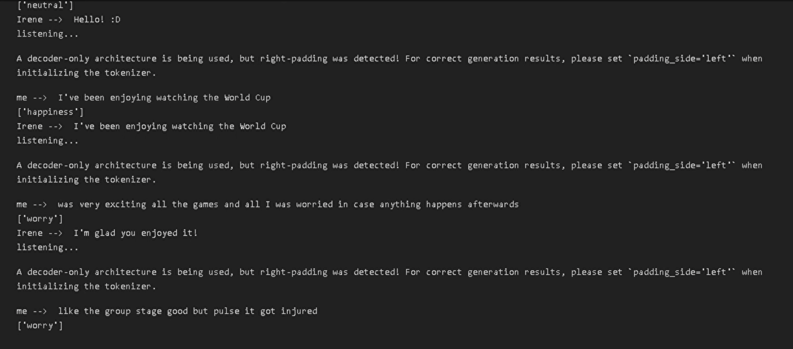
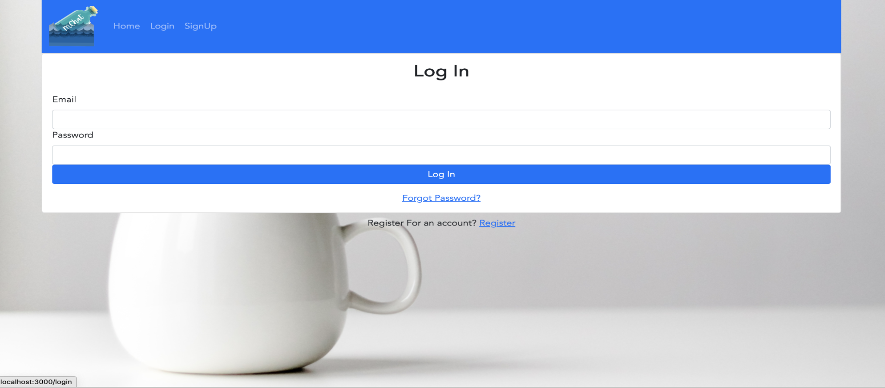
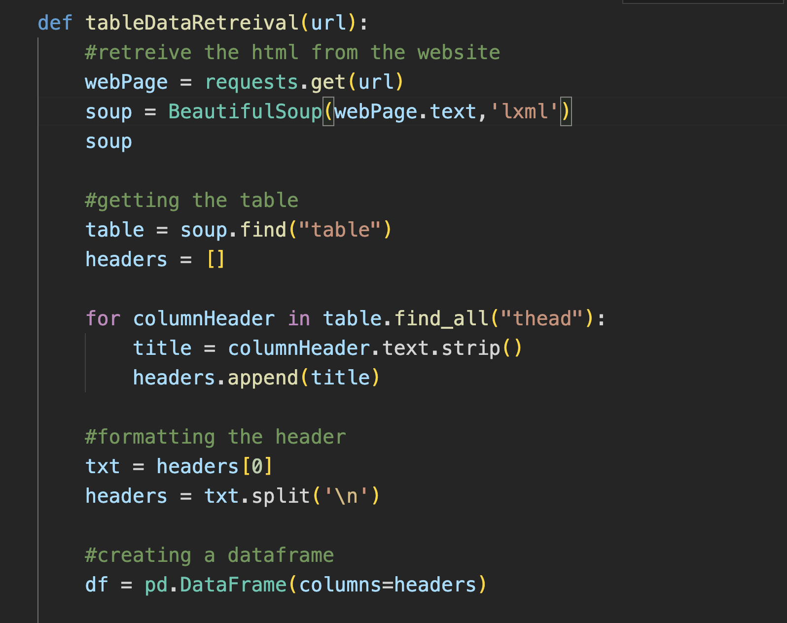
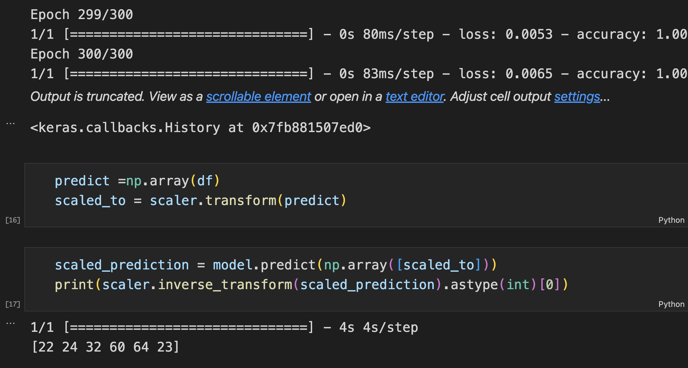
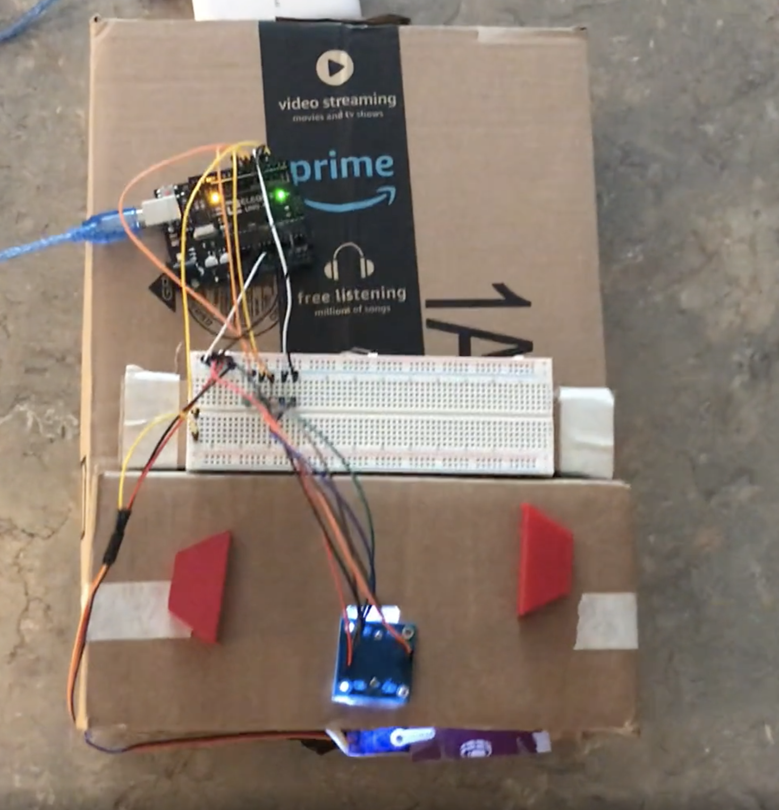
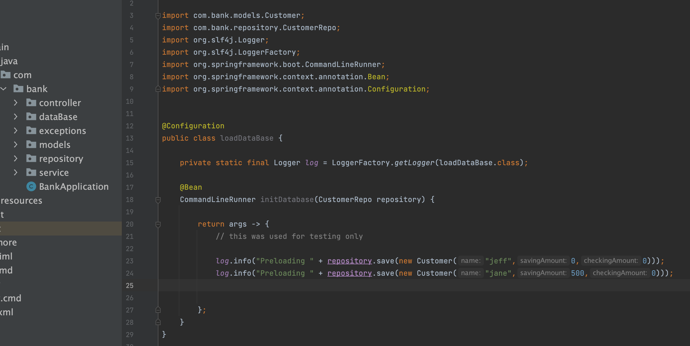
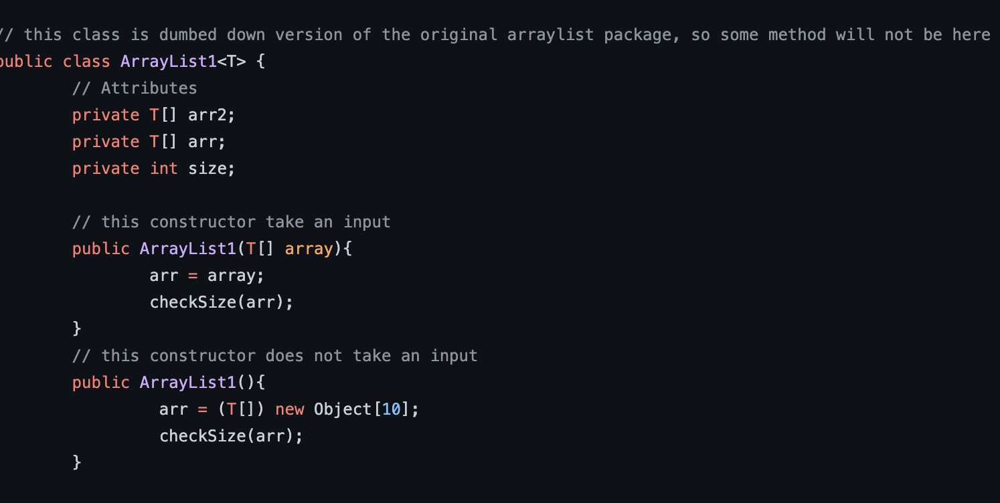
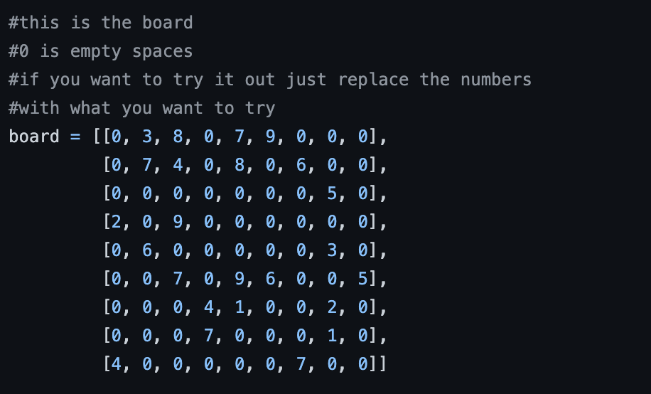

# Portfolio

- [LinkedIn:](https://www.linkedin.com/in/evan-timko-4008a81a2/)
- [Github:](https://github.com/EvanTimko)
- [Porfolio:](https://evantimko.github.io/portfolio/)
  
## Education

- Bachelor's of Science in Computer Science
- GPA: 3:81

## Work Experience

### Student Mentor

Delaware State University · Part-time

Aug 2022 - Dec 2022 · 5 months

Dover, Delaware, United States · Hybrid

- Helped with guidance, advice, feedback, and support to my mentee

### Software Engineer Intern

CSC · Internship
Jun 2022 - Aug 2022 · 3 months

Wilmington, Delaware, United States

- Writing software in Java for extending and maintaining microservices and API frameworks(in spring)
- Building stable, scalable, and secure backend services
- Building software deployment pipelines using CI/CD best practices
- Assisted the team with technical documentation, Quality Assurance testing, and Business requirements
- Debugging and researching 
- Being an active participant in the SCRUM software development process by working closely with other team members to deliver working software

### Student Mentor

Delaware State University · Part-time

Aug 2021 - May 2022 · 10 months

Dover, Delaware, United States · Hybrid

- Helped with guidance, advice, feedback, and support to the mentee

### Software Engineer

Code Differently · Internship

May 2021 - Aug 2021 · 4 months

Wilmington, Delaware, United States

- Created and Designed multiple spring boot applications.
- Created multiple applications using data structures and algorithms.
- Applied Object Oriented Programing in Java.

### Software Engineer

Code Differently · Internship

May 2021 to Aug 2021 · 4 months

Wilmington, Delaware, United States

- Created and Designed multiple spring boot applications.
- Created multiple applications using data structures and algorithms.
- Applied Object Oriented Programing in Java.

### Tutor/TA

Delaware State University · Part-time

Aug 2020 - May 2021 · 10 months

Dover, Delaware, United States

- Helped 20+ students to understand basic of programming to apply to their assignments and final project
- Tutoring, teaching labs and helping in classroom for 10hrs each week.

### Lifeguard

Killens Pond Water Park - Seasonal

May 2016-Sep 2016 - May 2018-Sep 2018 - May 2019-Sep 2019

Felton, DE

- Maintained safety and order in pool and slide areas; regularly cleaned and tested pool and provided first aid and help to the patrons

## Licenses & Certifications 

### Certified ScrumMaster (CSM)
Scrum Alliance

Issued Jul 2021 · Expired Jul 2023

Credential ID 001226662

[Link:](https://bcert.me/bc/html/show-badge.html?b=vfwgjtng)

### Private Pilots Liciense
Issued  Feb 2018

### Google Data Analytics 
Issued: March 2025

[Link:](https://www.coursera.org/account/accomplishments/professional-cert/certificate/OMYBJ3YN19VR)

## Skills
Python - Java - JavaScript - C - R - Microsoft - Mac - Linux - Git - React - Figma(Software) - Agile/Scrum Methodologies - Data Structures - Data mining - Data Cleaning - DataBases - SQL - Search/Writing Querying - Data Analytics - Analytical Skills - Problem Solving - MySQL - Microssoft Word/Excel/PowerPoint/Access - Jupyter Notebook - Project Management - Networks - Front and Back end Development - Application Program Interfaces(API's) - Spring Boot - Algorithms - Machine Learning - Google Sheets - Tableau

## Projects

### Emotion Detection

In Python, created a program that can detect one’s sentiment. By collecting data online of text related to emotion then cleaning the data then using logistic regression with pipelining and count vectorizing, which show one’s emotion based on user’s text input.

Used: Python(Libraries) - Jupyter Notbook

### Mchat

Using React.js, developed a messaging platform. That used Firebase to authenticate user and Chatengine an API that is setup to handle messaging between user and used react to connect the two software together to create a functional messaging platform.

Used: React.js - Node.js - JavaScript - Firebase - Chat Engine

### Case Study: Bike-Share Company

The scenerio is a Bike-Share company in Chicago is hiring me as a junior data analyst. My team will dive into differences between casual users and annual members use. From these insights we have to leverage the data to convert casual users to members. Objective was to find out how members and casual consumers use the cyclistic bikes differently? And how could we convince casual riders to purchase a membership? I downloaded, cleaned, filtered, and graphed the data. And Came to the summation that the casual consumers use the service more during the weekends and the when its warmer weather out. While, the members tend to use it more during the weekdays and they also prefer the warmer weather but retain membership in winter just don't use a bike to much. I suggest was to expand pricing plans so instead of 3 that more that are board for the casual user, so then they could then possible become member.

used: R

### Web Scrapper

In Python, developed a program using BeautifulSoup, request, and pandas to gather visual table from websites. This is done by searching for table tags in the html processing the data off the website into a data frame then saving it to csv. Which allows user to use for later analisys.

Used: Python(Libraries) - Jupyter Notbook

### P2P Sharing Network

A network application that can be both the client(consumer or requester) and a server (producer or provider). When a peer wants to make a
resource available, it registers its content in the network. Such as peer A can send a file/document to peer B and they just have to accept the it. We accomplished this by using threading to allow the host to open the server and tkinter to make a nice little GUI so the user could easily use.

Used: Python(Sockets, Libraries)

### Lottery Number Predictor

Using Python, utilized my web scrapper and redesighned to collect the numbers out the website. Cleaned and organized the data then using Sklearn and Keras trained the machine to predict the potential numbers.

Used: Python(Libraries)

### Color Sorter

Using C++ and Arduino, I created a simple color sorter that will Identify the color passing a sensor and if the color matches the expected hue then the servo will push it off the belt into the proper container.

Used: C++

### API Bank Account

Using Spring Boot, I created a simple API that will allow a user to create a bank account and deposit and withdraw money from it. However, I was not able to implenment security in this project. I gain an enormous amount of knowledge from this project and I am glad I was able to create it.

Used: Spring Boot - Java

### My ArrayList

Using Java, I took a data structure and redesigned it. I chose ArrayList and recoded with my personal touches with some method being left out and some new method being added into it, also I used generics', so one can pass a parameter type or leave it raw type if they so decide. This was fun because it depend my understanding of the data structure and how to use it.

Used: Java

### Soduku Solver

Using Python, I sought to solve a simple veryday puzzle one may find themselves doing on the pot. This was a fun project to create and solve. I used the backtracking algorithm to solve the puzzle. So, in a simpleir way I made it so that every time it encounter the same number in a row or column it will attempt a different number and if not it will go back and try again and if succeeful continue to move forward going back and forth until it is solved.

Used: Python

## Pong

Using Python, I remade the classic game of Pong. I used the pygame library to create the game. So, basically players move their bars on the side to score with the ball bouncing through other players side as well as keeping track of the score.

Used: Python(Pygame)
